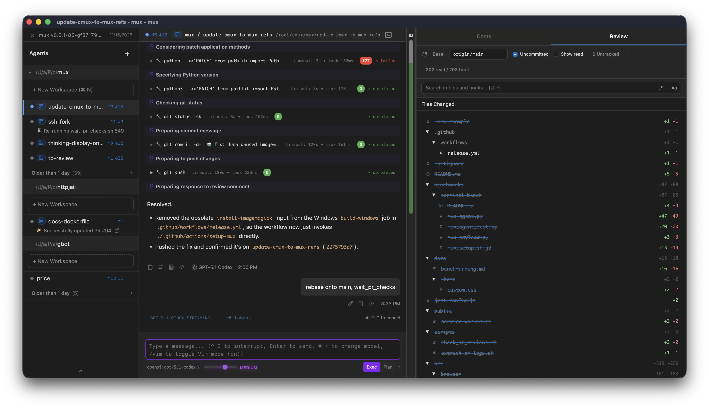
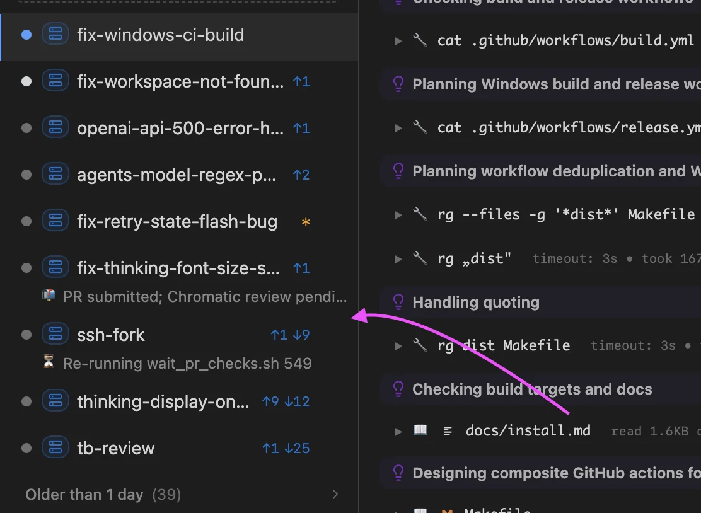

# mux - coding agent multiplexer

A desktop application for parallel agentic development.

Why parallelize?

Here are some specific use cases we enable:

- **Contextual continuity between relevant changes**:
  - e.g. create a workspace for `code-review`, `refactor`, and `new-feature`
- **GPT-5-Pro**: use the slow but powerful GPT-5-Pro for complex issues
  - Run in the background for hours on end
  - The stream will automatically resume after restarts or intermittent connection issues. If the model completes early we will show an indicator.
- **A/B testing**: run multiple workspaces in parallel on the same problem but different approaches,
  abandon the bad ones.
- **Tangent exploration**: launch tangents in `mux` away from main work

## Features

- **Isolated workspaces** with central view on git divergence
  - **Local**: git worktrees on your local machine ([docs](https://cmux.io/local.html))
  - **SSH**: regular git clones on a remote server ([docs](https://cmux.io/ssh.html))
- **Multi-model** (`sonnet-4-*`, `gpt-5-*`, `opus-4-*`)
  - Ollama supported for local LLMs ([docs](https://cmux.io/models.html#ollama-local))
  - OpenRouter supported for long-tail of LLMs ([docs](https://cmux.io/models.html#openrouter-cloud))
- **VS Code Extension**: Jump into mux workspaces directly from VS Code ([docs](https://cmux.io/vscode-extension.html))
- Supporting UI and keybinds for efficiently managing a suite of agents
- Rich markdown outputs (mermaid diagrams, LaTeX, etc.)

mux has a custom agent loop but much of the core UX is inspired by Claude Code. You'll find familiar features like Plan/Exec mode, vim inputs, `/compact` and new ones
like [opportunistic compaction](https://cmux.io/context-management.html) and [mode prompts](https://cmux.io/instruction-files.html#mode-prompts).

**[Read the full documentation →](https://cmux.io)**

## Install

> [!WARNING]  
> mux is in a Preview state. You will encounter bugs and performance issues.
> It's still possible to be highly productive. We are using it almost exclusively for our own development.

Download pre-built binaries from [the releases page](https://github.com/coder/mux/releases) for
macOS and Linux.

[More on installation →](https://cmux.io/install.html)

## Screenshots

  
<em>Integrated code-review for faster iteration:

  

  
<em>Agents report their status through the sidebar:</em>

  

  
<em>Git divergence UI keeps you looped in on changes and potential conflicts:</em>

  

  
<em>Mermaid diagrams make it easier to review complex proposals from the Agent:</em>

  

  
<em>Project secrets help split your Human and Agent identities:</em>

  

  
<em>Stay looped in on costs and token consumption:</em>

  

  
<em>Opportunistic compaction helps keep context small:</em>

  

## More reading

See [the documentation](https://cmux.io) for more details.

## Development

See [AGENTS.md](./AGENTS.md) for development setup and guidelines.

## License

Copyright (C) 2025 Coder Technologies, Inc.

This program is free software: you can redistribute it and/or modify it under the terms of the GNU Affero General Public License as published by the Free Software Foundation, version 3 of the License.

See [LICENSE](./LICENSE) for details.
